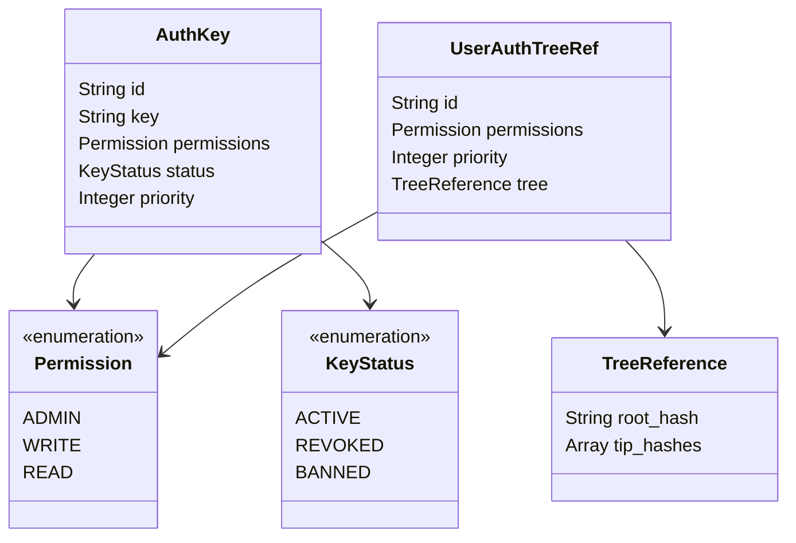
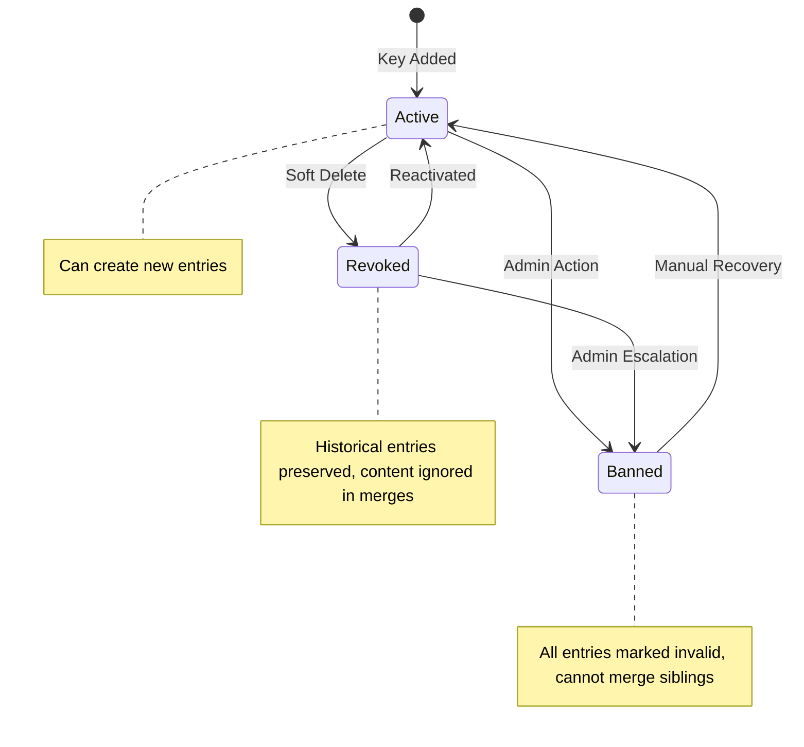
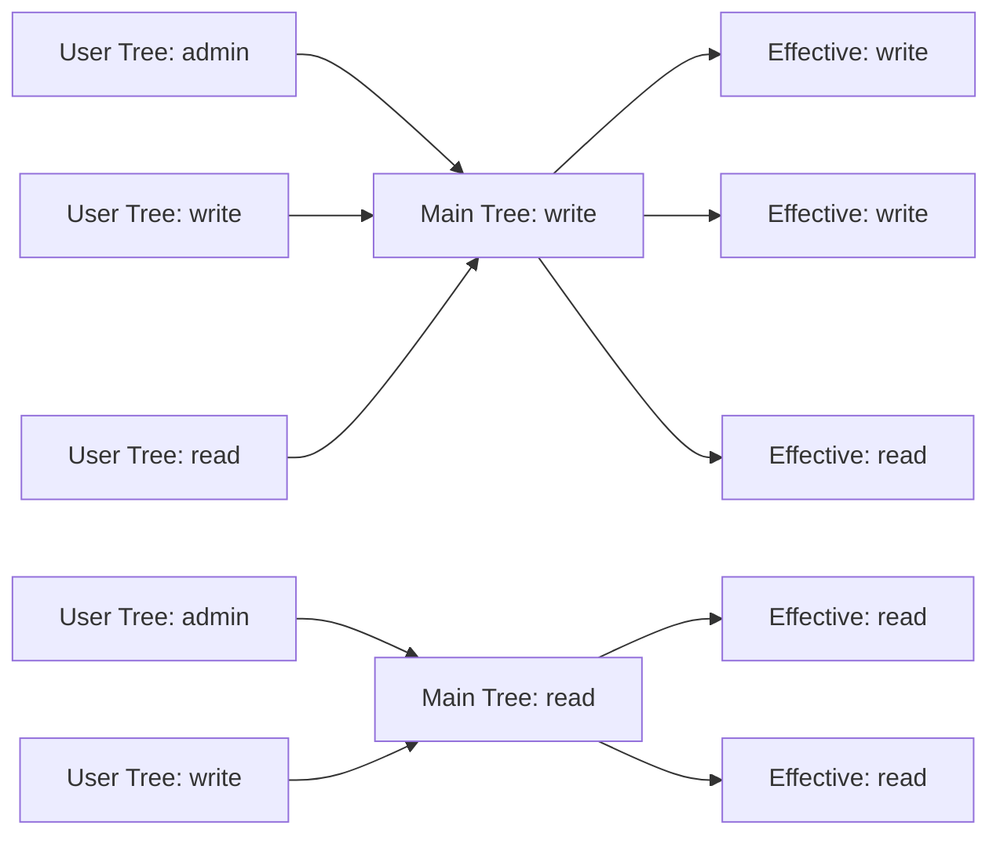
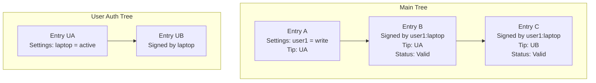
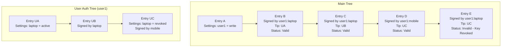
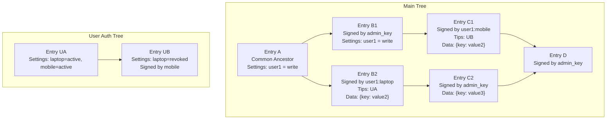
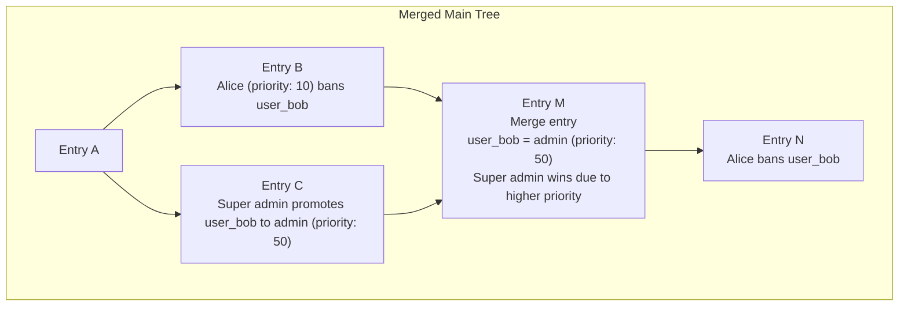
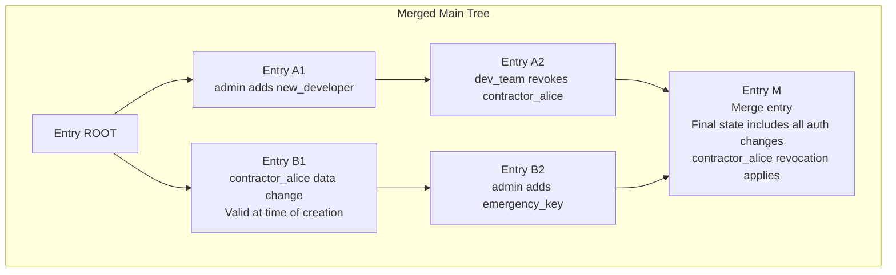

**Document Status**: Draft - Authentication system not yet implemented

# Authentication Design

This document outlines the authentication and authorization scheme for Eidetica, a decentralized database built on Merkle-CRDT principles. The design emphasizes flexibility, security, and integration with the core CRDT system while maintaining distributed consistency.

## Table of Contents

- [Authentication Design](#authentication-design)
  - [Table of Contents](#table-of-contents)
  - [Overview](#overview)
  - [Design Goals and Principles](#design-goals-and-principles)
    - [Primary Goals](#primary-goals)
    - [Non-Goals](#non-goals)
  - [System Architecture](#system-architecture)
    - [Authentication Data Location](#authentication-data-location)
    - [Permission Hierarchy](#permission-hierarchy)
  - [Authentication Framework](#authentication-framework)
    - [Key Structure](#key-structure)
    - [Direct Key Example](#direct-key-example)
    - [Entry Signing Format](#entry-signing-format)
  - [Key Management](#key-management)
    - [Key Lifecycle](#key-lifecycle)
    - [Key Status Semantics](#key-status-semantics)
    - [Priority System](#priority-system)
      - [When Does Priority Matter?](#when-does-priority-matter)
  - [User Authentication Trees](#user-authentication-trees)
    - [Concept and Benefits](#concept-and-benefits)
    - [Structure](#structure)
    - [Permission Clamping](#permission-clamping)
    - [Multi-Level References](#multi-level-references)
    - [User Auth Tree references](#user-auth-tree-references)
    - [Key Revocation](#key-revocation)
  - [Conflict Resolution and Merging](#conflict-resolution-and-merging)
    - [Key Revocation in User Auth Trees: Examples](#key-revocation-in-user-auth-trees-examples)
      - [Example 1: Basic User Auth Tree Key Revocation](#example-1-basic-user-auth-tree-key-revocation)
      - [Example 2: Sibling Branch Merge with Revoked Key](#example-2-sibling-branch-merge-with-revoked-key)
      - [Example 3: Priority-Based Conflict Resolution](#example-3-priority-based-conflict-resolution)
  - [Authorization Scenarios](#authorization-scenarios)
    - [Network Partition Recovery](#network-partition-recovery)
  - [Security Considerations](#security-considerations)
    - [Threat Model](#threat-model)
      - [Protected Against](#protected-against)
      - [Requires Manual Recovery](#requires-manual-recovery)
    - [Cryptographic Assumptions](#cryptographic-assumptions)
    - [Attack Vectors](#attack-vectors)
      - [Mitigated](#mitigated)
      - [Partial Mitigation](#partial-mitigation)
      - [Not Addressed](#not-addressed)
  - [Implementation Details](#implementation-details)
    - [Authentication Validation Process](#authentication-validation-process)
    - [Sync Permissions](#sync-permissions)
    - [CRDT Metadata Considerations](#crdt-metadata-considerations)
  - [Future Considerations](#future-considerations)
    - [Open Questions](#open-questions)
  - [References](#references)

## Overview

Eidetica's authentication scheme is designed to leverage the same CRDT and Merkle-DAG principles that power the core database while providing robust access control for distributed environments. Unlike traditional authentication systems, this design must handle authorization conflicts that can arise from network partitions and concurrent modifications to access control rules.

The authentication system is **not** implemented as a pure consumer of the database API but is tightly integrated with the core system. This integration enables efficient validation and conflict resolution during entry creation and tree merging operations.

## Design Goals and Principles

### Primary Goals

1. **Distributed Consistency**: Authentication rules must merge deterministically across network partitions
2. **Cryptographic Security**: All authentication based on public/private key cryptography, with upgradable algorithms
3. **Hierarchical Access Control**: Support admin, read/write, and read-only permission levels
4. **User Autonomy**: Users can manage their own keys without requiring admin intervention
5. **Auditability**: All authentication changes are tracked in the immutable DAG history

### Non-Goals

- **Perfect Security**: Admin key compromise requires manual intervention
- **Real-time Revocation**: Key revocation is eventually consistent, not immediate

## System Architecture

### Authentication Data Location

Authentication configuration is stored in the special `_settings` subtree under the `auth` key. This placement ensures that:

- Authentication rules are included in `_settings`, which contains all the data necessary to validate the tree and add new Entries
- Access control changes are tracked in the immutable history
- Settings can be validated against the current entry being created

NB: This isn't accurate? \_settings has conflicts
The `_settings` subtree uses `KVNested` CRDT structure, allowing for hierarchical organization of authentication data while maintaining conflict-free merging properties using a Last-Write-Wins method.

**Clarification**: Throughout this document, when we refer to `KVNested`, this is the hierarchical CRDT implementation that supports nested maps. The `_settings` subtree specifically uses `KVNested` to enable complex authentication configurations.

### Permission Hierarchy

Eidetica implements a three-tier permission model:

| Permission Level | Modify `_settings` | Add/Remove Keys | Change Permissions | Read Data | Write Data | Public Tree Access |
| ---------------- | ------------------ | --------------- | ------------------ | --------- | ---------- | ------------------ |
| **Admin**        | ✓                  | ✓               | ✓                  | ✓         | ✓          | ✓                  |
| **Write**        | ✗                  | ✗               | ✗                  | ✓         | ✓          | ✓                  |
| **Read**         | ✗                  | ✗               | ✗                  | ✓         | ✗          | ✓                  |

## Authentication Framework

### Key Structure

Each authentication key consists of several components stored in the `_settings.auth` configuration:



### Direct Key Example

```json
{
  "_settings": {
    "auth": {
      "KEY_LAPTOP": {
        "key": "ssh-ed25519:AAAAC3NzaC1lZDI1NTE5AAAAI...",
        "permissions": "write",
        "status": "active",
        "priority": 10
      },
      "KEY_DESKTOP": {
        "key": "ssh-ed25519:AAAAC3NzaC1lZDI1NTE5AAAAI...",
        "permissions": "read",
        "status": "active",
        "priority": 20
      },
      "*": {
        "permissions": "read",
        "status": "active"
      }
    },
    "name": "My Tree"
  }
}
```

**Note**: The wildcard key `*` enables global permissions, commonly used for world-readable trees. Wildcard keys do not have a priority field since they cannot perform administrative operations.

### Entry Signing Format

When creating an entry, the authentication information is embedded in the entry structure in a top-level `auth` field. `auth.id` must provide a direct reference to which key is used and it's location for validating it's permissions.

```json
{
  "tree": {
    "root": "tree_root_id",
    "parents": ["parent_entry_id"],
    "data": "{\"key\": \"value\"}",
    "metadata": "{\"_settings\": [\"settings_tip_id\"]}"
  },
  "subtrees": [
    {
      "name": "users",
      "parents": ["parent_entry_id"],
      "data": "{\"user_data\": \"example\"}"
    }
  ],
  "auth": {
    "id": "KEY_LAPTOP",
    "signature": "ed25519_signature_bytes_hex_encoded"
  }
}
```

For User Auth Tree keys, the authentication structure is more complex:

```json
{
  "auth": {
    "id": {
      "id": "example@eidetica.dev",
      "tips": ["abc123def456"],
      "key": "KEY_LAPTOP"
    },
    "signature": "ed25519_signature_bytes_hex_encoded"
  }
}
```

For nested User Auth Tree references:

```json
{
  "auth": {
    "id": {
      "id": "example@eidetica.dev",
      "tips": ["current_tip"],
      "key": {
        "id": "old-identity",
        "tips": ["old_tip"],
        "key": "LEGACY_KEY"
      }
    },
    "signature": "ed25519_signature_bytes_hex_encoded"
  }
}
```

Deeply nested Auth Tree references are discouraged.

## Key Management

### Key Lifecycle



### Key Status Semantics

1. **Active**: Key can create new entries and all historical entries remain valid
2. **Revoked**: Key cannot create new entries. During CRDT merges, sibling branches containing revoked entries can be merged, but the content of revoked entries is ignored
3. **Banned**: Key cannot create new entries. Sibling branches containing banned entries cannot be merged

**Key Behavioral Details**:

- Entries that are ancestors of the status change action always remain valid to preserve history integrity
- Revoked/Banned semantics apply to sibling chains and future entries, not the historical chain leading to the status change
- An Admin can transition an entry back to Active state from either Revoked or Banned status
- Revoked status enables graceful key deprecation while maintaining history integrity
- Banned status is reserved for compromised keys or malicious activity requiring manual intervention

### Priority System

Priority **only impacts administrative actions**, which are limited to modifications of the `_settings` subtree. A priority setting on a non-admin key has no effect.

Keys include a priority field (positive integers, lower values = higher priority) to establish administrative hierarchy:

- Priority `0`: Typically reserved for the initial super-admin key
- Higher priority keys (lower numbers) can modify keys with lower priority (higher numbers)
- The default Priority is the lowest priority
- Priority enables recovery from compromised admin keys by higher-priority keys
- Priority ties are resolved by lexicographic ordering of key IDs as a deterministic fallback

**Priority Rules**:

- A key can only create or modify keys with priority > its own priority
- Priority 0 keys have universal authority over all other keys
- Multiple keys can share the same priority level
- Priority inheritance: User Auth Tree keys inherit the priority from their main tree reference
- When delegating through User Auth Trees, the effective priority is always taken from the outermost (main tree) reference

#### When Does Priority Matter?

When merging two chains that have conflicting auth settings, the higher priority write wins.

## User Authentication Trees

### Concept and Benefits

User Authentication Trees allow users to maintain their own key hierarchies without requiring admin permissions on the main tree. This provides:

- **User Autonomy**: Users control their own key addition/removal
- **Consistent Identity**: Same user identity across multiple trees
- **Privacy**: Users can maintain multiple authentication trees for different Identities
- **Delegation**: Users can create sub-keys for different purposes

User Auth Trees are normal Trees, and their normal auth settings are used.

### Structure

A User Auth Tree reference in the main tree's `_settings.auth` contains:

```json
{
  "_settings": {
    "auth": {
      "example@eidetica.dev": {
        "permissions": "admin",
        "priority": 15,
        "tree": {
          "root": "hash_of_root_entry",
          "tips": ["hash1", "hash2"]
        }
      }
    }
  }
}
```

The referenced User Auth Tree maintains its own `_settings.auth` with direct keys:

```json
{
  "_settings": {
    "auth": {
      "KEY_LAPTOP": {
        "key": "ssh-ed25519:AAAAC3NzaC1lZDI1NTE5AAAAI...",
        "permissions": "admin",
        "status": "active",
        "priority": 0
      },
      "KEY_MOBILE": {
        "key": "ssh-ed25519:AAAAC3NzaC1lZDI1NTE5AAAAI...",
        "permissions": "write",
        "status": "active"
      }
    }
  }
}
```

### Permission Clamping

Permissions in User Auth Trees are clamped to the maximum allowed in the main tree using a minimum function, while the effective priority is always taken from their definition in the main tree:



**Clamping Rules**:

- Effective permission = min(user_tree_permission, main_tree_permission)
- Effective priority = main_tree_priority (always inherited, never from user tree)
- User Auth Tree admin permissions only apply within that user's tree
- Permission clamping occurs at each level of delegation chains

### Multi-Level References

User Auth Trees can reference other User Auth Trees, creating delegation chains:

```json
{
  "auth": {
    "id": {
      "id": "example@eidetica.dev",
      "tips": ["current_tip"],
      "key": {
        "id": "old-identity",
        "tips": ["old_tip"],
        "key": "LEGACY_KEY"
      }
    },
    "signature": "signature_bytes"
  }
}
```

**Delegation Chain Rules**:

- Permission clamping applies at each level using the minimum function
- Priority is always determined by the outermost (main tree) reference
- Tips must be valid at each level of the chain for the delegation to be valid

### User Auth Tree references

The main tree must validate the User Auth Tree structure as well as the main tree.

User Auth Tree tip references must be validated against the latest known tips at the tim of validating an Entry or merging chains. The tips of the User Auth Tree can not refer to "old" tips as seen by the parents of the Entry, and the validity of the User Auth Tree keys are handled recursivly using the same rules as the Main Tree when merging chains.

### Key Revocation

User Auth Tree key deletion is always treated as `revoked` status in the main tree, preventing users from creating unresolvable conflicts. If we allowed User Auth Tree Bans to affect the Main Tree, this would allow users without Admin permissions in thee main tree to delete existing Entries made by other Users.

By allowing User Auth Tree's to revoke their own keys, they can edit only their own Entries in the Main Tree.

## Conflict Resolution and Merging

Conflicts in the `_settings` tree are merged following the priority rules. If the tree has diverged with both sides of the merge having written to the `_settings` tree, the write with the highest priority will win.

This is applied to User Auth Trees as well. A write to the Main Tree must also recursively merge any changed settings in the User Auth Trees so as to handle network splits in the User Auth Trees.

### Key Revocation in User Auth Trees: Examples

The following examples demonstrate how key revocation in User Auth Trees affects entries in the main tree.

#### Example 1: Basic User Auth Tree Key Revocation

**Initial State**:



**After Key Revocation in User Auth Tree**:



**Key Points**:

- Entries B and C remain valid as they were created before the revocation
- Entry E is invalid because it was created after the revocation
- The key revocation only affects future entries, not existing ones in the ancestry

#### Example 2: Sibling Branch Merge with Revoked Key



**Key Points**:

- Entry B2 is preserved in history but the content is ignored during merge because the laptop key was revoked in C1
- The merge operation can proceed normally (unlike with banned keys) to preserve the data added in C2 that occurred because of the network split
- The final merged state reflects only non-revoked contributions
- The effective tip for the User Auth Tree at Entry D is UB

#### Example 3: Priority-Based Conflict Resolution

**Scenario**: Two admins with different priority levels make conflicting authentication changes during a network partition.

**After Network Reconnection and Merge**:



**Key Points**:

- All administrative actions are preserved in history
- Priority system resolves the conflict: super_admin (priority 0) overrides admin_alice (priority 10)
- The merged state reflects the higher-priority decision
- Lower priority cannot override higher priority, ensuring administrative hierarchy
- Alice can still ban user_bob as long as she acks the Super admin change by having it in the history

## Authorization Scenarios

### Network Partition Recovery

When network partitions occur, the authentication system must handle concurrent changes gracefully:

**Scenario**: Two branches of the tree independently modify the auth settings, requiring CRDT-based conflict resolution.

Both branches share the same root, but a network partition has caused them to diverge before merging back together.



**Conflict Resolution Rules Applied**:

- **Settings Merge**: All authentication changes are merged using KVNested CRDT semantics
- **Priority Enforcement**: Changes are ordered by the priority of the signing key
- **Historical Validity**: Entry B1 remains valid because it was created before the revocation, **but content is dropped**
- **Future Restrictions**: Future entries by contractor_alice would be rejected
- **Administrative Hierarchy**: All admin-level changes (priority 0 and 10) take precedence over team-level changes (priority 20)

## Security Considerations

### Threat Model

#### Protected Against

- **Unauthorized Entry Creation**: All entries must be signed by valid keys
- **Permission Escalation**: Users cannot grant themselves higher privileges than their main tree reference
- **Historical Tampering**: Immutable DAG prevents retroactive modifications
- **Replay Attacks**: Content-addressable IDs prevent entry duplication
- **Priority Bypassing**: Lower priority keys cannot modify higher priority keys
- **Mutual Banning**: Multiple network partitions banning each other's keys is resolved by highest priority key
- **Priority Conflicts**: Ties in priority levels resolved by key ID lexicographic ordering, and keys disallowed from creating new keys at the same priority level

#### Requires Manual Recovery

- **Admin Key Compromise**: When no higher-priority key exists

### Cryptographic Assumptions

- **Ed25519 Security**: Default to ed25519 signatures with explicit key type storage
- **Hash Function Security**: SHA-256 for content addressing
- **Key Storage**: Private keys must be securely stored by clients
- **Network Security**: Assumption of eventually consistent but potentially unreliable network

### Attack Vectors

#### Mitigated

- **Key Replay**: Content-addressable entry IDs prevent signature replay
- **Downgrade Attacks**: Explicit key type storage prevents algorithm confusion
- **Partition Attacks**: CRDT merging handles network partition scenarios
- **Privilege Escalation**: Permission clamping prevents users from exceeding granted permissions

#### Partial Mitigation

- **DoS via Large Histories**: Priority system limits damage from compromised lower-priority keys
- **Social Engineering**: Administrative hierarchy limits scope of individual key compromise
- **Timestamp Manipulation**: CRDT merge ordering provides deterministic conflict resolution

#### Not Addressed

- **Side-Channel Attacks**: Client-side key storage security is out of scope
- **Physical Key Extraction**: Assumed to be handled by client security measures
- **Long-term Cryptographic Breaks**: Future crypto-agility may be needed

## Implementation Details

### Authentication Validation Process

The validation process follows these steps:

1. **Extract Authentication Info**: Parse the `auth` field from the entry
2. **Resolve Key Identity**: For direct keys, lookup in `_settings.auth`; for User Auth Tree keys, validate tree reference and lookup in referenced tree
3. **Check Key Status**: Verify the key is active (not revoked or banned)
4. **Validate Signature**: Verify the ed25519 signature against the entry content
5. **Check Permissions**: Ensure the key has sufficient permissions for the operation
6. **Apply Permission Clamping**: For User Auth Tree keys, apply permission clamping rules

### Sync Permissions

Eidetica servers require proof of read permissions before allowing tree synchronization. The server challenges the client to sign a random nonce, then validates the signature against the tree's authentication configuration.

### CRDT Metadata Considerations

The current system uses entry metadata to reference settings tips. With authentication:

- Metadata continues to reference current `_settings` tips for validation efficiency
- Authentication validation uses the settings state at the referenced tips
- This ensures entries are validated against the authentication rules that were current when created

## Future Considerations

### Open Questions

1. What is the appropriate maximum delegation chain depth?
   This document does not specify a maximum, but implementation considerations may require limits for performance.

## References

1. [Eidetica Core Concepts](../user_guide/core_concepts.md)
2. [CRDT Principles](../internal/crdt_principles.md)
3. [Entry Structure](../internal/core_components/entry.md)
