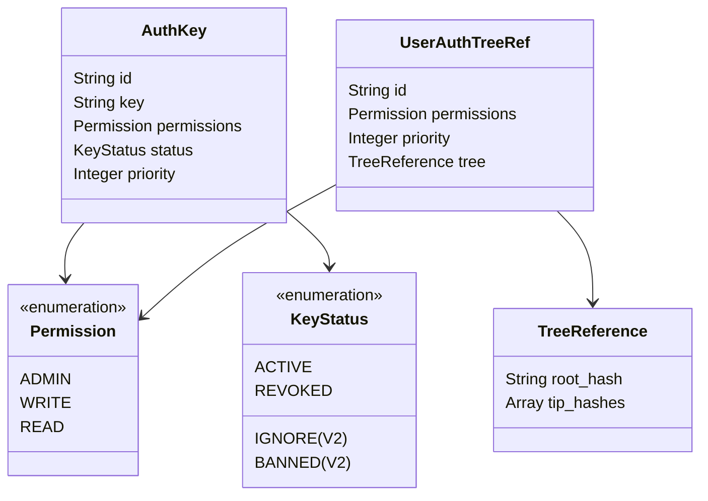
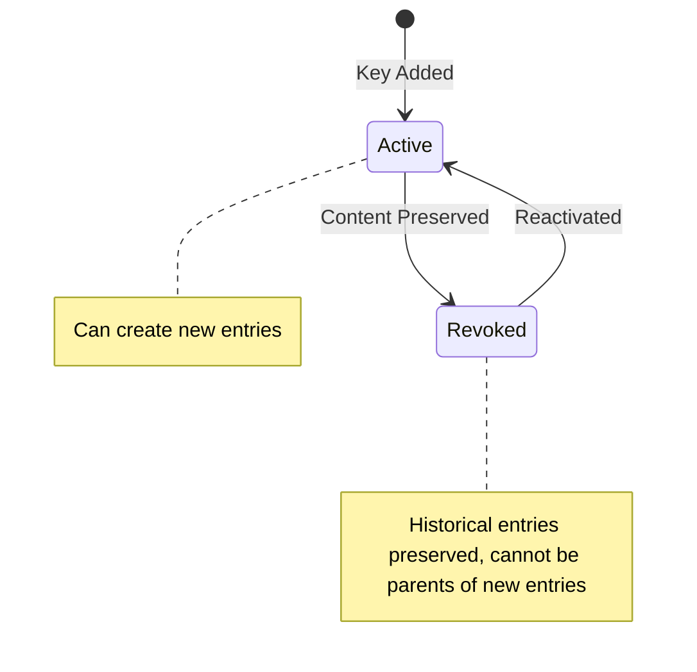
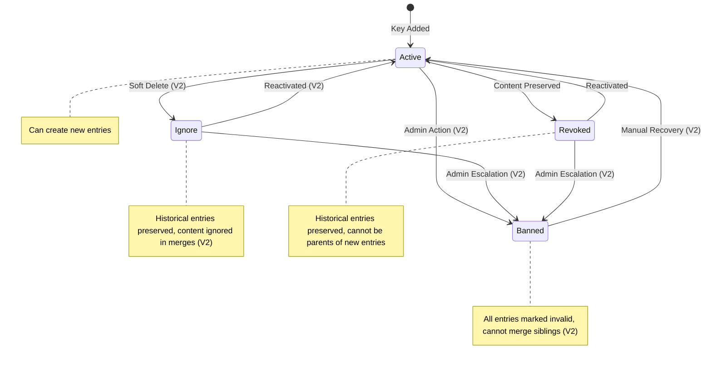
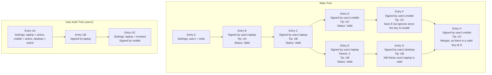
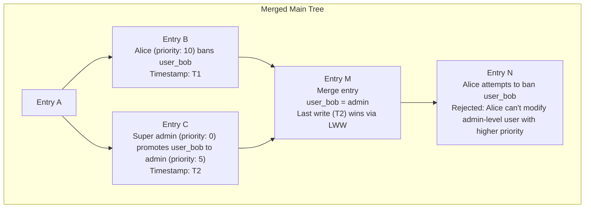
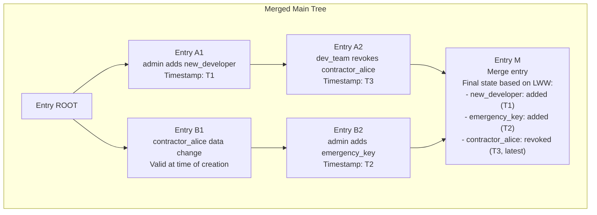

**Document Status**: Draft - Authentication system not yet implemented

# Authentication Design

This document outlines the authentication and authorization scheme for Eidetica, a decentralized database built on Merkle-CRDT principles. The design emphasizes flexibility, security, and integration with the core CRDT system while maintaining distributed consistency.

## Table of Contents

- [Authentication Design](#authentication-design)
  - [Table of Contents](#table-of-contents)
  - [Overview](#overview)
  - [Design Goals and Principles](#design-goals-and-principles)
    - [Primary Goals](#primary-goals)
    - [Non-Goals](#non-goals)
  - [System Architecture](#system-architecture)
    - [Authentication Data Location](#authentication-data-location)
    - [Permission Hierarchy](#permission-hierarchy)
  - [Authentication Framework](#authentication-framework)
    - [Key Structure](#key-structure)
    - [Direct Key Example](#direct-key-example)
    - [Entry Signing Format](#entry-signing-format)
  - [Key Management](#key-management)
    - [Key Lifecycle](#key-lifecycle)
    - [Key Status Semantics](#key-status-semantics)
    - [Priority System](#priority-system)
      - [When Does Priority Matter?](#when-does-priority-matter)
  - [User Authentication Trees](#user-authentication-trees)
    - [Concept and Benefits](#concept-and-benefits)
    - [Structure](#structure)
    - [Permission Clamping](#permission-clamping)
    - [Multi-Level References](#multi-level-references)
    - [User Auth Tree references](#user-auth-tree-references)
    - [Key Revocation](#key-revocation)
  - [Conflict Resolution and Merging](#conflict-resolution-and-merging)
    - [Key Status Changes in User Auth Trees: Examples](#key-status-changes-in-user-auth-trees-examples)
      - [Example 1: Basic User Auth Tree Key Status Change](#example-1-basic-user-auth-tree-key-status-change)
      - [Example 2: Last Write Wins Conflict Resolution](#example-2-last-write-wins-conflict-resolution)
  - [Authorization Scenarios](#authorization-scenarios)
    - [Network Partition Recovery](#network-partition-recovery)
  - [Security Considerations](#security-considerations)
    - [Threat Model](#threat-model)
      - [Protected Against](#protected-against)
      - [Requires Manual Recovery](#requires-manual-recovery)
    - [Cryptographic Assumptions](#cryptographic-assumptions)
    - [Attack Vectors](#attack-vectors)
      - [Mitigated](#mitigated)
      - [Partial Mitigation](#partial-mitigation)
      - [Not Addressed](#not-addressed)
  - [Implementation Details](#implementation-details)
    - [Authentication Validation Process](#authentication-validation-process)
    - [Sync Permissions](#sync-permissions)
    - [CRDT Metadata Considerations](#crdt-metadata-considerations)
  - [Future Considerations](#future-considerations)
    - [Open Questions](#open-questions)
  - [References](#references)

## Overview

Eidetica's authentication scheme is designed to leverage the same CRDT and Merkle-DAG principles that power the core database while providing robust access control for distributed environments. Unlike traditional authentication systems, this design must handle authorization conflicts that can arise from network partitions and concurrent modifications to access control rules.

The authentication system is **not** implemented as a pure consumer of the database API but is tightly integrated with the core system. This integration enables efficient validation and conflict resolution during entry creation and tree merging operations.

## Design Goals and Principles

### Primary Goals

1. **Distributed Consistency**: Authentication rules must merge deterministically across network partitions
2. **Cryptographic Security**: All authentication based on public/private key cryptography, with upgradable algorithms
3. **Hierarchical Access Control**: Support admin, read/write, and read-only permission levels
4. **User Autonomy**: Users can manage their own keys without requiring admin intervention
5. **Auditability**: All authentication changes are tracked in the immutable DAG history

### Non-Goals

- **Perfect Security**: Admin key compromise requires manual intervention
- **Real-time Revocation**: Key revocation is eventually consistent, not immediate

## System Architecture

### Authentication Data Location

Authentication configuration is stored in the special `_settings` subtree under the `auth` key. This placement ensures that:

- Authentication rules are included in `_settings`, which contains all the data necessary to validate the tree and add new Entries
- Access control changes are tracked in the immutable history
- Settings can be validated against the current entry being created

NB: This isn't accurate? \_settings has conflicts
The `_settings` subtree uses `KVNested` CRDT structure, allowing for hierarchical organization of authentication data while maintaining conflict-free merging properties using a Last-Write-Wins method.

**Clarification**: Throughout this document, when we refer to `KVNested`, this is the hierarchical CRDT implementation that supports nested maps. The `_settings` subtree specifically uses `KVNested` to enable complex authentication configurations.

### Permission Hierarchy

Eidetica implements a three-tier permission model:

| Permission Level | Modify `_settings` | Add/Remove Keys | Change Permissions | Read Data | Write Data | Public Tree Access |
| ---------------- | ------------------ | --------------- | ------------------ | --------- | ---------- | ------------------ |
| **Admin**        | ✓                  | ✓               | ✓                  | ✓         | ✓          | ✓                  |
| **Write**        | ✗                  | ✗               | ✗                  | ✓         | ✓          | ✓                  |
| **Read**         | ✗                  | ✗               | ✗                  | ✓         | ✗          | ✓                  |

## Authentication Framework

### Key Structure

Each authentication key consists of several components stored in the `_settings.auth` configuration:



### Direct Key Example

```json
{
  "_settings": {
    "auth": {
      "KEY_LAPTOP": {
        "key": "ssh-ed25519:AAAAC3NzaC1lZDI1NTE5AAAAI...",
        "permissions": "write",
        "status": "active",
        "priority": 10
      },
      "KEY_DESKTOP": {
        "key": "ssh-ed25519:AAAAC3NzaC1lZDI1NTE5AAAAI...",
        "permissions": "read",
        "status": "active",
        "priority": 20
      },
      "*": {
        "permissions": "read",
        "status": "active"
      }
    },
    "name": "My Tree"
  }
}
```

**Note**: The wildcard key `*` enables global permissions, commonly used for world-readable trees. Wildcard keys do not have a priority field since they cannot perform administrative operations.

### Entry Signing Format

When creating an entry, the authentication information is embedded in the entry structure in a top-level `auth` field. `auth.id` must provide a direct reference to which key is used and it's location for validating it's permissions.

```json
{
  "tree": {
    "root": "tree_root_id",
    "parents": ["parent_entry_id"],
    "data": "{\"key\": \"value\"}",
    "metadata": "{\"_settings\": [\"settings_tip_id\"]}"
  },
  "subtrees": [
    {
      "name": "users",
      "parents": ["parent_entry_id"],
      "data": "{\"user_data\": \"example\"}"
    }
  ],
  "auth": {
    "id": "KEY_LAPTOP",
    "signature": "ed25519_signature_bytes_hex_encoded"
  }
}
```

For User Auth Tree keys, the authentication structure is more complex:

```json
{
  "auth": {
    "id": {
      "id": "example@eidetica.dev",
      "tips": ["abc123def456"],
      "key": "KEY_LAPTOP"
    },
    "signature": "ed25519_signature_bytes_hex_encoded"
  }
}
```

For nested User Auth Tree references:

```json
{
  "auth": {
    "id": [
      {
        "id": "example@eidetica.dev",
        "tips": ["current_tip"]
      },
      {
        "id": "old-identity",
        "tips": ["old_tip"]
      },
      {
        "key": "LEGACY_KEY"
      }
    ],
    "signature": "ed25519_signature_bytes_hex_encoded"
  }
}
```

Deeply nested Auth Tree references are discouraged.

## Key Management

**Note**: The current implementation focuses on **Active** and **Revoked** key statuses. **Ignore** and **Banned** statuses are planned for V2 and are included in this design for completeness.

### Key Lifecycle

**V1 Design:**



**Future V2 Features:**



### Key Status Semantics

**V1 Implementation:**

1. **Active**: Key can create new entries and all historical entries remain valid
2. **Revoked**: Key cannot create new entries. Historical entries remain valid, but new entries cannot have revoked entries as parents. Content of revoked entries is preserved during merges

**Future V2 Features:**

3. **Ignore** _(V2)_: Key cannot create new entries. During CRDT merges, sibling branches containing ignored entries can be merged, but the content of ignored entries is ignored
4. **Banned** _(V2)_: Key cannot create new entries. Sibling branches containing banned entries cannot be merged

**Key Behavioral Details**:

- Entries that are ancestors of the status change action always remain valid to preserve history integrity
- Revoked semantics apply to sibling chains and future entries, not the historical chain leading to the status change
- An Admin can transition an entry back to Active state from Revoked status
- **Revoked** status prevents new entries from building on revoked content while preserving existing content in merges
- _(V2)_ **Ignore** status will enable graceful key deprecation while maintaining history integrity, with content excluded from merges
- _(V2)_ **Banned** status will be reserved for compromised keys or malicious activity requiring manual intervention

### Priority System

Priority **only impacts administrative actions**, which are limited to modifications of the `_settings` subtree. Priority does **not** affect conflict resolution during merges - conflicts are resolved using the same Last Write Wins (LWW) strategy as the underlying KVNested CRDT.

Keys include a priority field (positive integers, lower values = higher priority) to establish administrative hierarchy:

- Priority `0`: Typically reserved for the initial super-admin key
- Higher priority keys (lower numbers) can modify keys with equal or lower priority (equal or higher numbers)
- The default Priority is the lowest priority
- Priority enables recovery from compromised admin keys by higher-priority keys
- Priority has **no effect** on merge conflict resolution

**Priority Rules**:

- A key can only create or modify keys with priority equal or lower than its own priority
- Priority 0 keys have universal authority over all other keys
- Multiple keys can share the same priority level, and keys at the same level can modify each other
- Priority inheritance: User Auth Tree keys inherit the priority from their main tree reference
- When delegating through User Auth Trees, the effective priority is always taken from the outermost (main tree) reference

#### When Does Priority Matter?

Priority **only** matters for administrative operations - specifically who can create, modify, or revoke keys in the `_settings.auth` configuration. Priority does **not** affect merge conflict resolution.

When merging two chains that have conflicting auth settings, the standard KVNested Last Write Wins (LWW) strategy is used, just like any other conflicting changes in the `_settings` tree.

## User Authentication Trees

### Concept and Benefits

User Authentication Trees allow users to maintain their own key hierarchies without requiring admin permissions on the main tree. This provides:

- **User Autonomy**: Users control their own key addition/removal
- **Consistent Identity**: Same user identity across multiple trees
- **Privacy**: Users can maintain multiple authentication trees for different Identities
- **Delegation**: Users can create sub-keys for different purposes

User Auth Trees are normal Trees, and their normal auth settings are used.

### Structure

A User Auth Tree reference in the main tree's `_settings.auth` contains:

```json
{
  "_settings": {
    "auth": {
      "example@eidetica.dev": {
        "permissions": "admin",
        "priority": 15,
        "tree": {
          "root": "hash_of_root_entry",
          "tips": ["hash1", "hash2"]
        }
      }
    }
  }
}
```

The referenced User Auth Tree maintains its own `_settings.auth` with direct keys:

```json
{
  "_settings": {
    "auth": {
      "KEY_LAPTOP": {
        "key": "ssh-ed25519:AAAAC3NzaC1lZDI1NTE5AAAAI...",
        "permissions": "admin",
        "status": "active",
        "priority": 0
      },
      "KEY_MOBILE": {
        "key": "ssh-ed25519:AAAAC3NzaC1lZDI1NTE5AAAAI...",
        "permissions": "write",
        "status": "active"
      }
    }
  }
}
```

### Permission Clamping

Permissions in User Auth Trees are clamped to the maximum allowed in the main tree using a minimum function, while the effective priority is always taken from their definition in the main tree:


**Clamping Rules**:

- Effective permission = min(user_tree_permission, main_tree_permission)
- Effective priority = main_tree_priority (always inherited, never from user tree)
- User Auth Tree admin permissions only apply within that user's tree
- Permission clamping occurs at each level of delegation chains

### Multi-Level References

User Auth Trees can reference other User Auth Trees, creating delegation chains:

```json
{
  "auth": {
    "id": [
      {
        "id": "example@eidetica.dev",
        "tips": ["current_tip"]
      },
      {
        "id": "old-identity",
        "tips": ["old_tip"]
      },
      {
        "key": "LEGACY_KEY"
      }
    ],
    "signature": "signature_bytes"
  }
}
```

**Delegation Chain Rules**:

- Each element in the `auth.id` array represents a step in the delegation chain
- The first element references the main tree's User Auth Tree
- Subsequent elements reference nested User Auth Trees or direct keys
- The final element must be a direct key reference
- Permission clamping applies at each level using the minimum function
- Priority is always determined by the outermost (main tree) reference
- Tips must be valid at each level of the chain for the delegation to be valid

### User Auth Tree references

The main tree must validate the User Auth Tree structure as well as the main tree.

User Auth Tree tip references must be validated against the latest known tips at the tim of validating an Entry or merging chains. The tips of the User Auth Tree can not refer to "old" tips as seen by the parents of the Entry, and the validity of the User Auth Tree keys are handled recursivly using the same rules as the Main Tree when merging chains.

### Key Revocation

User Auth Tree key deletion is always treated as `revoked` status in the main tree. This prevents new entries from building on the deleted key's content while preserving the historical content during merges. This approach maintains the integrity of existing entries while preventing future reliance on removed authentication credentials.

By treating User Auth Tree key deletion as `revoked` status, users can manage their own key lifecycle in the Main Tree while ensuring that:

- Historical entries remain valid and their content is preserved
- New entries cannot use the revoked key's entries as parents
- The merge operation proceeds normally with content preserved
- Users cannot create conflicts that would affect other users' valid entries

## Conflict Resolution and Merging

Conflicts in the `_settings` tree are merged using the same Last Write Wins (LWW) strategy as the underlying KVNested CRDT. When the tree has diverged with both sides of the merge having written to the `_settings` tree, the most recent write (by logical timestamp) will win, regardless of the priority of the signing key.

Priority rules apply only to **administrative permissions** - determining which keys can modify other keys - but do **not** influence the conflict resolution during merges.

This is applied to User Auth Trees as well. A write to the Main Tree must also recursively merge any changed settings in the User Auth Trees using the same LWW strategy to handle network splits in the User Auth Trees.

### Key Status Changes in User Auth Trees: Examples

The following examples demonstrate how key status changes in User Auth Trees affect entries in the main tree.

#### Example 1: Basic User Auth Tree Key Status Change

**Initial State**:


**After Key Status Change in User Auth Tree**:



#### Example 2: Last Write Wins Conflict Resolution

**Scenario**: Two admins make conflicting authentication changes during a network partition. Priority determines who can make the changes, but Last Write Wins determines the final merged state.

**After Network Reconnection and Merge**:



**Key Points**:

- All administrative actions are preserved in history
- Last Write Wins resolves the merge conflict: the most recent change (T2) takes precedence
- Priority still prevents unauthorized modifications: Alice cannot ban an admin:5 level user due to insufficient priority
- The merged state reflects the most recent write, not the highest priority
- Priority rules prevent Alice from making the change in Entry N, as she lacks authority to modify admin-level users

## Authorization Scenarios

### Network Partition Recovery

When network partitions occur, the authentication system must handle concurrent changes gracefully:

**Scenario**: Two branches of the tree independently modify the auth settings, requiring CRDT-based conflict resolution using Last Write Wins.

Both branches share the same root, but a network partition has caused them to diverge before merging back together.



**Conflict Resolution Rules Applied**:

- **Settings Merge**: All authentication changes are merged using KVNested CRDT semantics with Last Write Wins
- **Timestamp Ordering**: Changes are resolved based on logical timestamps, with the most recent change taking precedence
- **Historical Validity**: Entry B1 remains valid because it was created before the status change
- **Content Preservation**: With "revoked" status, content is preserved in merges but cannot be used as parents for new entries
- **Future Restrictions**: Future entries by contractor_alice would be rejected based on the applied status change

## Security Considerations

### Threat Model

#### Protected Against

- **Unauthorized Entry Creation**: All entries must be signed by valid keys
- **Permission Escalation**: Users cannot grant themselves higher privileges than their main tree reference
- **Historical Tampering**: Immutable DAG prevents retroactive modifications
- **Replay Attacks**: Content-addressable IDs prevent entry duplication
- **Administrative Hierarchy Violations**: Lower priority keys cannot modify higher priority keys (but can modify equal priority keys)
- **Race Conditions**: Last Write Wins provides deterministic conflict resolution

#### Requires Manual Recovery

- **Admin Key Compromise**: When no higher-priority key exists
- **Conflicting Administrative Changes**: LWW may result in unintended administrative state during network partitions

### Cryptographic Assumptions

- **Ed25519 Security**: Default to ed25519 signatures with explicit key type storage
- **Hash Function Security**: SHA-256 for content addressing
- **Key Storage**: Private keys must be securely stored by clients
- **Network Security**: Assumption of eventually consistent but potentially unreliable network

### Attack Vectors

#### Mitigated

- **Key Replay**: Content-addressable entry IDs prevent signature replay
- **Downgrade Attacks**: Explicit key type storage prevents algorithm confusion
- **Partition Attacks**: CRDT merging handles network partition scenarios
- **Privilege Escalation**: Permission clamping prevents users from exceeding granted permissions

#### Partial Mitigation

- **DoS via Large Histories**: Priority system limits damage from compromised lower-priority keys
- **Social Engineering**: Administrative hierarchy limits scope of individual key compromise
- **Timestamp Manipulation**: LWW conflict resolution is deterministic but may be influenced by the chosen timestamp resolution algorithm
- **Administrative Confusion**: Network partitions may result in unexpected administrative states due to LWW resolution

#### Not Addressed

- **Side-Channel Attacks**: Client-side key storage security is out of scope
- **Physical Key Extraction**: Assumed to be handled by client security measures
- **Long-term Cryptographic Breaks**: Future crypto-agility may be needed

## Implementation Details

### Authentication Validation Process

The validation process follows these steps:

1. **Extract Authentication Info**: Parse the `auth` field from the entry
2. **Resolve Key Identity**: For direct keys, lookup in `_settings.auth`; for User Auth Tree keys, validate tree reference and lookup in referenced tree
3. **Check Key Status**: Verify the key is active (not revoked). _(V2 will add ignore and banned status checks)_
4. **Validate Signature**: Verify the ed25519 signature against the entry content
5. **Check Permissions**: Ensure the key has sufficient permissions for the operation
6. **Apply Permission Clamping**: For User Auth Tree keys, apply permission clamping rules

### Sync Permissions

Eidetica servers require proof of read permissions before allowing tree synchronization. The server challenges the client to sign a random nonce, then validates the signature against the tree's authentication configuration.

### CRDT Metadata Considerations

The current system uses entry metadata to reference settings tips. With authentication:

- Metadata continues to reference current `_settings` tips for validation efficiency
- Authentication validation uses the settings state at the referenced tips
- This ensures entries are validated against the authentication rules that were current when created

## Future Considerations

### Open Questions

1. What is the appropriate maximum delegation chain depth?
   This document does not specify a maximum, but implementation considerations may require limits for performance.

## References

1. [Eidetica Core Concepts](../user_guide/core_concepts.md)
2. [CRDT Principles](../internal/crdt_principles.md)
3. [Entry Structure](../internal/core_components/entry.md)
