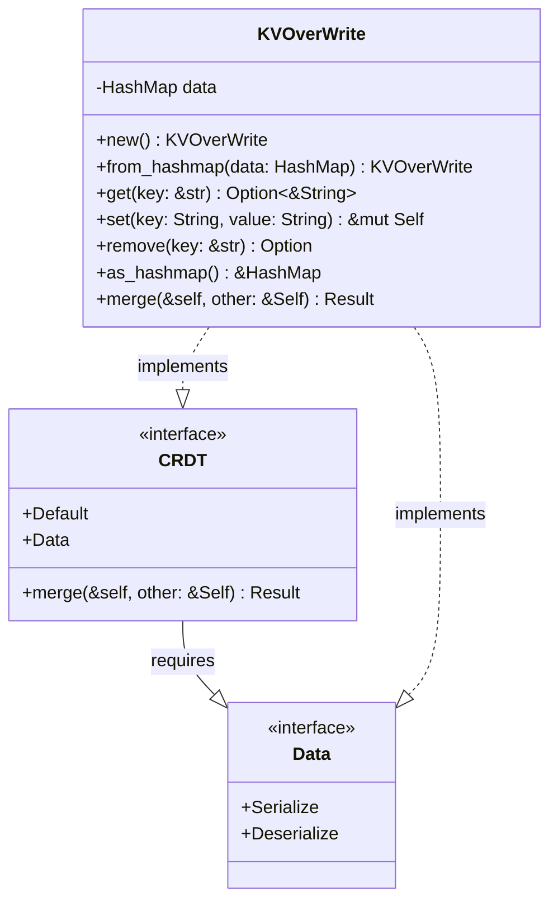

### CRDT Implementation

EideticaDB includes a trait-based system for Conflict-free Replicated Data Types (CRDTs) that enables conflict resolution. These are typically accessed via [`Operation::get_subtree`](basedb_tree.md) similarly to [`RowStore`](subtrees.md), but implement the `CRDT` trait for merge capabilities.

The goal is to support [Merkle-CRDT principles](../crdt_principles.md) where the CRDT state is stored within an [Entry's](entry.md) `RawData` and can be deterministically merged.



- **CRDT Trait**: Defines a `merge` operation for resolving conflicts between divergent states. Implementors must also implement `Serialize`, `Deserialize`, and `Default`.
- **KVOverWrite**: A simple key-value CRDT implementation using a last-write-wins strategy based on lexicographical comparison of values upon key collision during merge.
- **Serialization**: CRDTs implementing the trait are serialized to/from JSON (by default) for storage in `Entry`'s `RawData`.
- **Multiple CRDT Support**: The design allows for different CRDT types (each implementing the `CRDT` trait) to be used for different subtrees within the same `Tree`.

### Implementing a Custom CRDT

To add a new CRDT type:

1.  Define your CRDT struct (e.g., `struct MySet { items: HashSet<String> }`).
2.  Implement `Default`, `serde::Serialize`, `serde::Deserialize` for your struct.
3.  Implement the marker trait: `impl Data for MySet {}`.
4.  Implement the `CRDT` trait:
    ```rust
    impl CRDT for MySet {
        fn merge(&self, other: &Self) -> Result<Self> {
            // Implement your deterministic merge logic here
            let merged_items = self.items.union(&other.items).cloned().collect();
            Ok(MySet { items: merged_items })
        }
    }
    ```
5.  **(Optional but Recommended)** Create a corresponding `SubTree` handle (e.g., `MySetHandle`) that implements the `SubTree` trait. This handle provides a user-friendly API and interacts with `AtomicOp` (`get_local_data`, `get_full_state`, `update_subtree`) to manage the CRDT state during operations.
