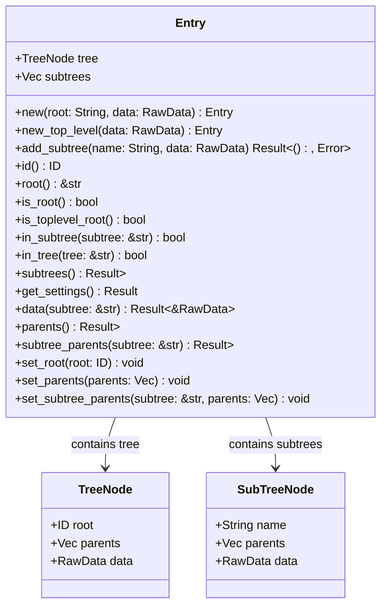

### Entry

Entries are the fundamental unit of data in EideticaDB. Each entry contains:

- **Tree**: Contains the root ID, parent references, and tree metadata
- **Subtrees**: Vector of named subtrees (equivalent to tables), each with their own parents and data
- **ID**: A unique content-addressable identifier (SHA-256 hash of its contents, represented as a hex `String`).

The entry structure enables efficient validation of data integrity and forms the basis of the Merkle tree structure.

- **`RawData`**: Defined as `type RawData = String;`. It holds serialized data (typically intended to be JSON, but not enforced) provided by the user.
- **CRDT Handling**: While the design aims for CRDT principles, the `Entry` itself stores serialized data as `RawData`. Specific CRDT logic (like merging) is handled by types that implement the `CRDT` trait (e.g., `KVOverWrite` used for settings in `BaseDB`), which are then serialized into/deserialized from `RawData`.
- **ID Generation**: Entry IDs are calculated deterministically. The entire `Entry` struct (including the `tree: TreeNode` and `subtrees: Vec<SubTreeNode>`) is serialized to a JSON string using `serde_json`. Before serialization, the `parents` vectors within `tree` and each `SubTreeNode`, along with the `subtrees` vector itself, are sorted alphabetically. This ensures the JSON string is canonical regardless of insertion order. The canonical JSON string is then hashed using SHA-256, and the resulting hash bytes are formatted as a hexadecimal string to produce the final `ID`. See [`Entry::id()`](../../src/entry.rs) (you might need to adjust the link path based on your source layout).
- **Parent References**: Each entry maintains parent references (`Vec<ID>`) for both the main tree (`tree.parents`) and optionally for each subtree (`SubTreeNode::parents`). These lists are always kept sorted alphabetically. When a new entry is typically created (e.g., via an `Operation` commit), the parents are usually set to the ID(s) of the current tip(s) of the tree/subtree being modified. This forms the links in the DAG. See [`Entry::set_parents()`](../../src/entry.rs) and [`Entry::set_subtree_parents()`](../../src/entry.rs).
