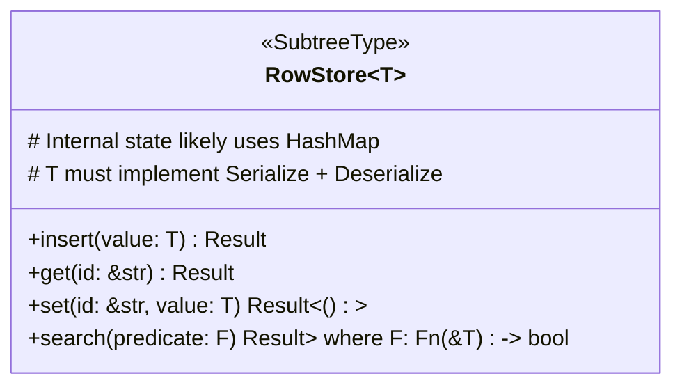
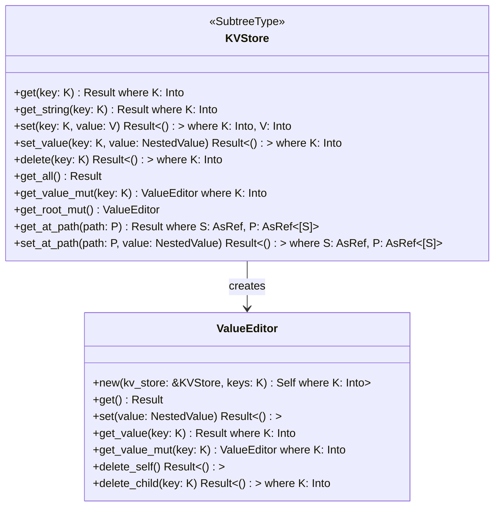

### Subtree Implementations

While [Entries](entry.md) store subtree data as raw serialized strings (`RawData`), specific implementations provide structured ways to interact with this data via the [`Operation`](basedb_tree.md) context. These implementations handle serialization/deserialization and provide typed APIs.

**Note on Naming:** Subtree names beginning with an underscore (e.g., `_settings`, `_root`) are reserved for internal EideticaDB use. Avoid using this prefix for user-defined subtrees to prevent conflicts.

Currently, the main specialized implementations are `RowStore<T>` and `KVStore`.

<!-- TODO: Add a section on the `SubtreeType` trait and how new types can be created. -->

### The `SubTree` Trait

Specific subtree types (like `RowStore`, `KVStore`, or custom CRDT implementations) are accessed through handles that implement the [`SubTree`](../../src/subtree/mod.rs) trait. This trait requires:

- `fn new(op: &AtomicOp, subtree_name: &str) -> Result<Self>`: An associated function used by `AtomicOp::get_subtree` to create a handle instance linked to the current operation.
- `fn name(&self) -> &str`: A method to retrieve the name of the subtree this handle manages.

Handles typically store a clone of the `AtomicOp` and the `subtree_name`.

To create a custom `SubTree` type:

1.  Define a struct for your handle.
2.  Implement the `SubTree` trait for it.
3.  Implement methods on your struct to provide the desired API (e.g., `get`, `set`, `add`).
4.  Internally, these methods will interact with the stored `AtomicOp`:
    - Use `op.get_local_data::<MyCRDT>()` to get the currently staged state for the operation.
    - Use `op.get_full_state::<MyCRDT>()` to get the merged historical state.
    - Use `op.update_subtree(self.name(), &serialized_new_state)` to stage updated CRDT data back into the operation.

#### RowStore<T>

`RowStore<T>` is a specialized subtree type designed for managing collections of records (structs `T`) where each record needs a unique, stable identifier.



**Features:**

- **Record Management**: Stores instances of a user-defined type `T` (where `T: Serialize + Deserialize`).
- **Automatic ID Generation**: Automatically generates a unique UUID (`String`) for each record inserted via `insert()`. This ID is used for subsequent `get()` and `set()` operations.
- **CRUD Operations**: Provides `insert`, `get`, `set`, and `search` methods for managing records.
- **Typed Access**: Accessed via `Operation::get_subtree::<RowStore<T>>("subtree_name")?`, providing type safety.

Internally, `RowStore<T>` manages its state (likely a map of IDs to `T` instances) and serializes it (e.g., to JSON) into the `RawData` field of the containing `Entry` when an `Operation` is committed.

<!-- TODO: Confirm the exact internal representation and serialization format. -->

`RowStore` is suitable for scenarios like managing a list of users, tasks (as in the Todo example), or any collection where individual items need to be addressed by a persistent ID.

#### KVStore

`KVStore` is a key-value store implementation that uses the `KVNested` CRDT to provide nested data structures and reliable deletion tracking across distributed systems.



**Features:**

- **Flexible Data Structure**: Based on `KVNested`, which allows storing both simple string values and nested map structures.
- **Tombstone Support**: When a key is deleted, a tombstone is created to ensure the deletion propagates correctly during synchronization, even if the value doesn't exist in some replicas.
- **Key Operations**:

  - `get`: Returns the value for a key as a `NestedValue` (String, Map, or error if deleted)
  - `get_string`: Convenience method that returns a string value (errors if the value is a map)
  - `set`: Sets a simple string value for a key
  - `set_value`: Sets any valid `NestedValue` (String, Map, or Deleted) for a key
  - `delete`: Marks a key as deleted by creating a tombstone
  - `get_all`: Returns the entire store as a `KVNested` structure, including tombstones
  - `get_value_mut`: Returns a `ValueEditor` for modifying values at a specific key path
  - `get_root_mut`: Returns a `ValueEditor` for the root of the KVStore's subtree
  - `get_at_path`: Retrieves a value at a specific nested path
  - `set_at_path`: Sets a value at a specific nested path

- **ValueEditor**: Provides a fluent API for navigating and modifying nested structures in the KVStore:

  - Allows traversing into nested maps through method chaining
  - Supports reading, writing, and deleting values at any level of nesting
  - Changes made via ValueEditor are staged in the AtomicOp and must be committed to persist

- **Merge Strategy**: When merging two KVStore states:
  - If both have string values for a key, the newer one wins
  - If both have map values, the maps are recursively merged
  - If types differ (map vs string) or one side has a tombstone, the newer value wins
  - Tombstones are preserved during merges to ensure proper deletion propagation

`KVStore` is ideal for configuration data, metadata, and hierarchical data structures that benefit from nested organization. The tombstone mechanism ensures consistent behavior in distributed environments where deletions need to propagate reliably.

Example usage:

```rust
let op = tree.new_operation()?;
let kv = op.get_subtree::<KVStore>("config")?;

// Set simple string values
kv.set("username", "alice")?;

// Create nested structures
let mut preferences = KVNested::new();
preferences.set_string("theme", "dark");
preferences.set_string("language", "en");
kv.set_value("user_prefs", NestedValue::Map(preferences))?;

// Using ValueEditor to modify nested structures
let editor = kv.get_value_mut("user_prefs");
editor.get_value_mut("theme").set(NestedValue::String("light".to_string()))?;
editor.get_value_mut("notifications").set(NestedValue::String("enabled".to_string()))?;

// Using path-based APIs with string literals directly
kv.set_at_path(["user", "profile", "email"], NestedValue::String("user@example.com".to_string()))?;
let email = kv.get_at_path(["user", "profile", "email"])?;

// Delete keys (creating tombstones)
kv.delete("old_setting")?;
// Or using ValueEditor
editor.delete_child("deprecated_setting")?;

// Commit changes
op.commit()?;
```

Other subtree types can be implemented, particularly those adhering to the [CRDT System](crdt.md).
