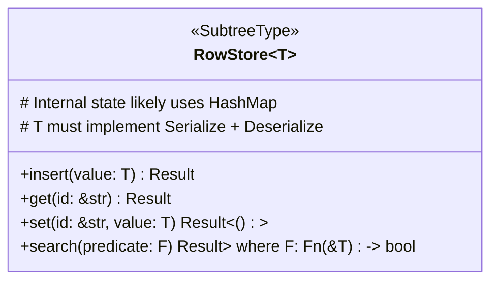

### Subtree Implementations

While [Entries](entry.md) store subtree data as raw serialized strings (`RawData`), specific implementations provide structured ways to interact with this data via the [`Operation`](basedb_tree.md) context. These implementations handle serialization/deserialization and provide typed APIs.

**Note on Naming:** Subtree names beginning with an underscore (e.g., `_settings`, `_root`) are reserved for internal EideticaDB use. Avoid using this prefix for user-defined subtrees to prevent conflicts.

Currently, the main specialized implementation is `RowStore<T>`.

<!-- TODO: Add a section on the `SubtreeType` trait and how new types can be created. -->

### The `SubTree` Trait

Specific subtree types (like `RowStore`, `KVStore`, or custom CRDT implementations) are accessed through handles that implement the [`SubTree`](../../src/subtree/mod.rs) trait. This trait requires:

- `fn new(op: &AtomicOp, subtree_name: &str) -> Result<Self>`: An associated function used by `AtomicOp::get_subtree` to create a handle instance linked to the current operation.
- `fn name(&self) -> &str`: A method to retrieve the name of the subtree this handle manages.

Handles typically store a clone of the `AtomicOp` and the `subtree_name`.

To create a custom `SubTree` type:

1.  Define a struct for your handle.
2.  Implement the `SubTree` trait for it.
3.  Implement methods on your struct to provide the desired API (e.g., `get`, `set`, `add`).
4.  Internally, these methods will interact with the stored `AtomicOp`:
    - Use `op.get_local_data::<MyCRDT>()` to get the currently staged state for the operation.
    - Use `op.get_full_state::<MyCRDT>()` to get the merged historical state.
    - Use `op.update_subtree(self.name(), &serialized_new_state)` to stage updated CRDT data back into the operation.

#### RowStore<T>

`RowStore<T>` is a specialized subtree type designed for managing collections of records (structs `T`) where each record needs a unique, stable identifier.

**Features:**

- **Record Management**: Stores instances of a user-defined type `T` (where `T: Serialize + Deserialize`).
- **Automatic ID Generation**: Automatically generates a unique UUID (`String`) for each record inserted via `insert()`. This ID is used for subsequent `get()` and `set()` operations.
- **CRUD Operations**: Provides `insert`, `get`, `set`, and `search` methods for managing records.
- **Typed Access**: Accessed via `Operation::get_subtree::<RowStore<T>>("subtree_name")?`, providing type safety.

Internally, `RowStore<T>` manages its state (likely a map of IDs to `T` instances) and serializes it (e.g., to JSON) into the `RawData` field of the containing `Entry` when an `Operation` is committed.

<!-- TODO: Confirm the exact internal representation and serialization format. -->

`RowStore` is suitable for scenarios like managing a list of users, tasks (as in the Todo example), or any collection where individual items need to be addressed by a persistent ID.

Other subtree types can be implemented, particularly those adhering to the [CRDT System](crdt.md).
