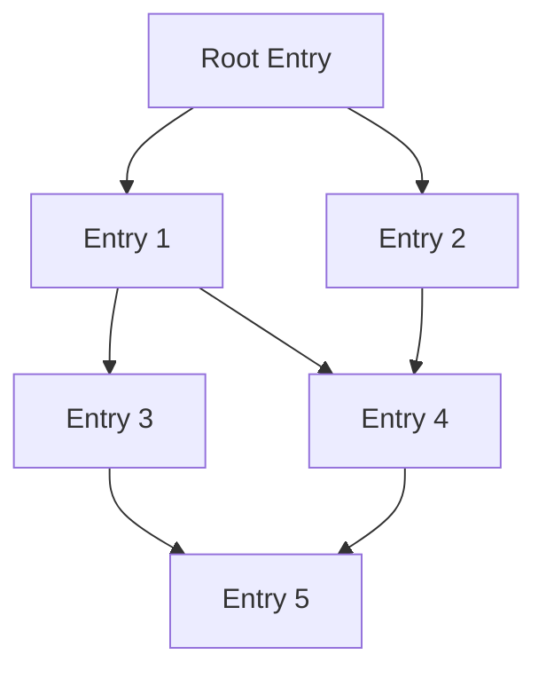
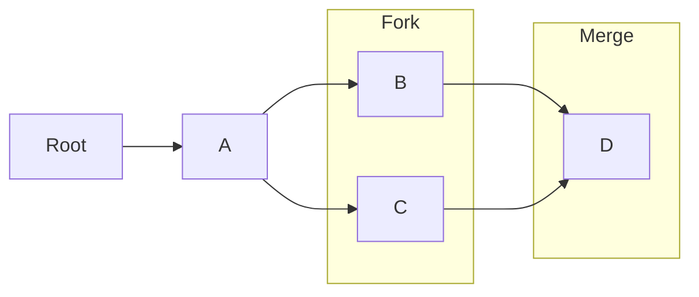

## CRDT Principles

EideticaDB implements a form of Merkle-CRDT, which uses Merkle trees built from content-addressable [Entries](core_components/entry.md) to efficiently synchronize distributed data. Key aspects include:

- Content-addressable entries (`Entry` struct) forming a Merkle DAG (Directed Acyclic Graph).
- Entries store data as `RawData` (serialized strings), but specific operations (like settings management or `get_subtree_data`) utilize types implementing the [`CRDT` trait](core_components/crdt.md) for deterministic merging.
- Tree structure ([`BaseDB`](core_components/basedb_tree.md), [`Tree`](core_components/basedb_tree.md)) supports efficient synchronization primitives like finding tips (`get_tips`, `get_subtree_tips`).
- Parent references (`parents` fields in `TreeNode` and `SubTreeNode`) maintain history and define the DAG structure.

### Fork and Merge Support

EideticaDB supports branching (forking) and merging of data histories:

- **Forking**: Multiple entries can share the same parent(s), creating divergent branches of history.
- **Merging**: An entry can have multiple parents, merging separate branches. Merges occur implicitly when an [`AtomicOp`](../core_components/basedb_tree.md#operation-lifecycle-atomicopsrcatomicoprs) creates a new `Entry` whose parents are the current tips of the tree/subtree. When historical data is read (e.g., via `AtomicOp::get_full_state`), the system traverses the DAG from the relevant parent tips and merges the `RawData` from each ancestor `Entry` using the appropriate [`CRDT::merge`](core_components/crdt.md) logic for the specific subtree type. Conflict resolution logic is entirely contained within the CRDT's `merge` implementation; EideticaDB applies the merge function but does not resolve conflicts between different CRDT types or interpret their state.
- **Parent-Child Relationships**: Maintained through parent reference lists in entries.
- **Tips**: Repository heads (entries with no children in a specific tree/subtree) are tracked as "tips" by the backend (`get_tips`, `get_subtree_tips`). These are used primarily to set the parent references for new entries created via `AtomicOp`. **Assumption:** For synchronization between replicas, peers likely exchange tips. A receiving peer would identify unknown tips, request the corresponding entries and their ancestors until a common history is found, and merge the new entries into their local backend. This process would rely heavily on the deterministic `CRDT::merge` implementations.
- **Deterministic Ordering**: The `InMemoryBackend` sorts entries topologically primarily by height (longest path from a DAG root) and secondarily by ID. Height is calculated using a BFS approach (similar to Kahn's algorithm) starting from nodes with an in-degree of 0 within the relevant context (tree or subtree). See `InMemoryBackend::calculate_heights` and related sorting methods in [`src/backend/in_memory.rs`](../../src/backend/in_memory.rs).
