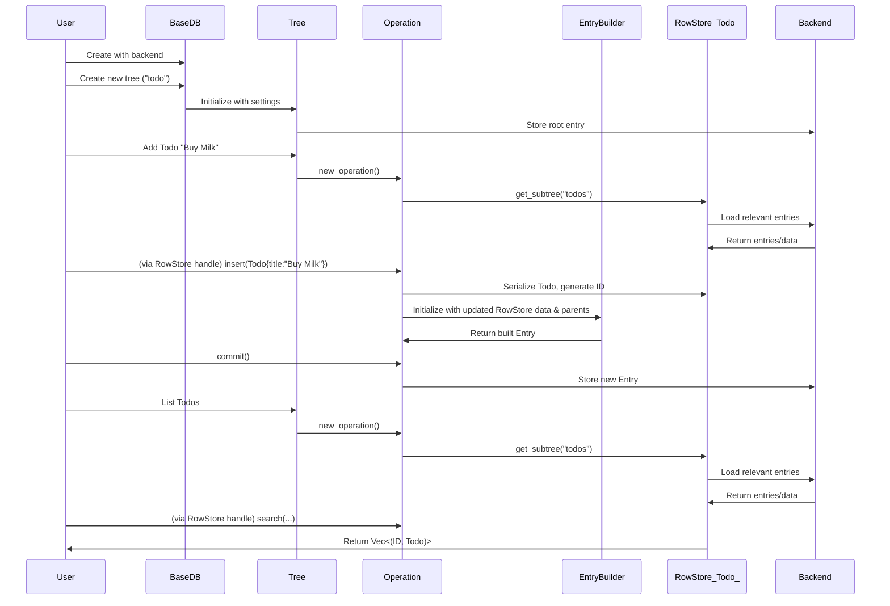

## Data Flow

This section illustrates a typical sequence of interactions between the user and the [core components](core_components/index.md).

1. User creates a BaseDB with a specific backend implementation
2. User creates one or more Trees within the database
3. Operations on the database involve an `EntryBuilder` to construct new, immutable `Entry` objects, which are then added to the appropriate Tree.
4. Each new Entry references its parent entries, forming a directed acyclic graph
5. Entries are stored and retrieved through the Backend interface

