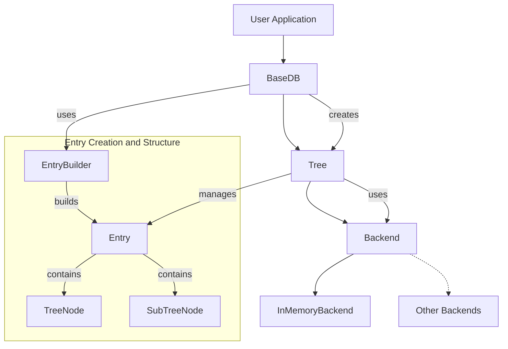

# EideticaDB Architecture Overview

EideticaDB is a decentralized database designed to "Remember Everything." This document outlines the architecture and how different components interact with each other.

EideticaDB is built on a foundation of content-addressable entries organized in trees, with a pluggable backend system for storage. `Entry` objects are immutable. The database is designed with concepts from Merkle-CRDTs to enable efficient merging and synchronization of distributed data.

See the [Core Components](core_components/index.md) section for details on the key building blocks.

